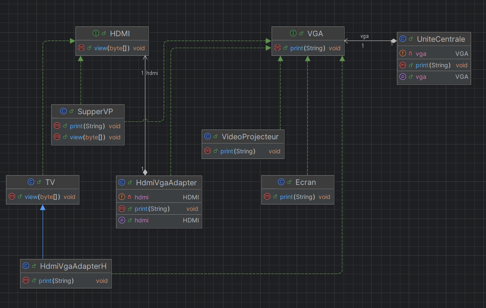

# 🧩 Design Pattern — Adapter

## 🎯 Objectif

Illustrer l’implémentation du **Design Pattern Adapter** en Java pour permettre la compatibilité entre des interfaces différentes (VGA et HDMI).

---

## 📚 Définition

### Catégorie
- **Structure**

### Objectifs du pattern

- **Convertir l’interface d’une classe** dans une autre interface comprise par la partie cliente.
- **Permettre à des classes de fonctionner ensemble**, alors que cela n’aurait pas été possible à cause d’interfaces incompatibles.

### Résultat

👉 Le Design Pattern Adapter permet **d’isoler l’adaptation d’un sous-système** sans modifier son code.

---

## 🏗️ Contexte de l’exemple

Dans ce projet :

| Élément | Rôle |
|--------|------|
| `VGA` | Interface utilisée par l’unité centrale |
| `HDMI` | Interface d’affichage plus récente |
| `UniteCentrale` | Client qui ne sait parler qu’en VGA |
| `TV`, `SupperVP` | Appareils HDMI (et parfois VGA) |
| `HdmiVgaAdapter`, `HdmiVgaAdapterH` | Adaptateurs HDMI → VGA |

L’adaptateur joue le rôle de **traducteur** entre deux mondes.

---

## Diagramme de Classe :




## 🔌 Exemple d’adaptateur
````java
public class HdmiVgaAdapter implements VGA {

    private HDMI hdmi;

    @Override
    public void print(String message) {
        byte[] bytes = message.getBytes();
        hdmi.view(bytes);
    }

    public void setHdmi(HDMI hdmi) {
        this.hdmi = hdmi;
    }
}

````
➡️ L’unité centrale continue d’appeler print() (VGA),

➡️ l’adaptateur convertit vers view() (HDMI).

## ▶️ Exécution (classe Test)

````java
    UniteCentrale uniteCentrale = new UniteCentrale();
    uniteCentrale.setVga(new Ecran());
    uniteCentrale.print("Bonjour");
    
    HdmiVgaAdapter adapter = new HdmiVgaAdapter();
    adapter.setHdmi(new TV());
    uniteCentrale.setVga(adapter);
    uniteCentrale.print("Bonsoir");

````
## 🖨️ Résultat obtenu

````shell
    ++++++++++++Ecran VGA++++++++++++++
    Bonjour
    ++++++++++++Ecran VGA++++++++++++++
    
    ----------TV----------
    Bonsoir
    ----------TV----------

````
- Puis avec d’autres périphériques :
````shell
___________SupperVP VGA___________
SALAMO3ALAYKOM
___________SupperVP VGA___________

___________SupperVP HDMI ___________
SALAMO3ALAYKOM
___________SupperVP HDMI ___________

````

----
👨‍💻 **RABIH Hamza** - M2- II-BDCC- ENSET Mohammédia

