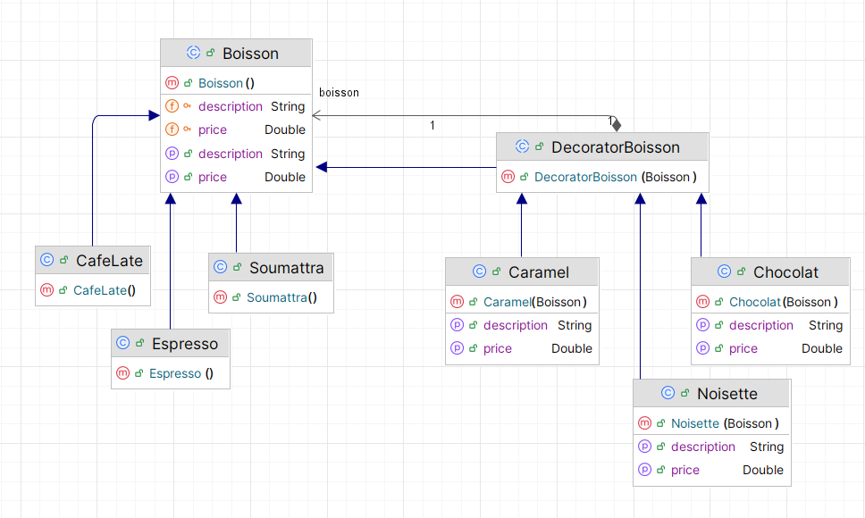
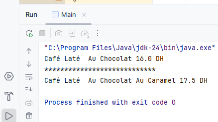

# 🧩 Design Pattern Décorateur

## 🎯 Objectif
Mettre en œuvre un exemple d’application illustrant le pattern Décorateur (Decorator Pattern) en programmation orientée objet.
Ce pattern permet d’ajouter dynamiquement de nouvelles fonctionnalités à un objet sans modifier sa structure.

## 🧠 Définition du Pattern Décorateur

Le pattern Décorateur est un patron de conception structurel qui permet d’attacher dynamiquement des responsabilités supplémentaires à un objet.
Il offre une alternative flexible à l’héritage pour étendre les comportements d’une classe.

**Catégorie**  : Structure

## Diagramme de Classe :



## 🖥️ Resultat D execution :

```java
public class Main {
    public static void main(String[] args) {
        Chocolat chocoCafeLate=new Chocolat((new CafeLate()));
        System.out.println(chocoCafeLate.getDescription() + " " + chocoCafeLate.getPrice()+" DH");
        System.out.println("****************************");
        Caramel caramelChocoCafeLate=new Caramel(chocoCafeLate);
        System.out.println(caramelChocoCafeLate.getDescription() + " " + caramelChocoCafeLate.getPrice()+" DH");
    }
}
```



----
👨‍💻 **RABIH Hamza** - M2- II-BDCC- ENSET Mohammédia

