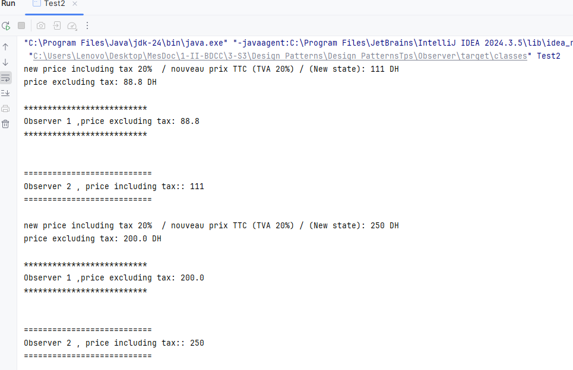

# 🧩 Design Pattern Observer

## 🎯 Objectif

Illustrer l’implémentation du design pattern Observer en programmation orientée objet.

 Ce pattern définit une relation one-to-many : lorsqu’un objet Observable change d’état, tous les Observers qui y sont abonnés sont automatiquement notifiés et mis à jour.

**Deux modes de notification sont présentés** :

- Push : l’Observable envoie directement le nouvel état aux Observers.
- Pull : l’Observer récupère lui-même l’état auprès de l’Observable.
 ##  🏗️ Structure
- **Observable** : la valeur suivie est le prix d’un produit.
- **Observer 1** : calcule la moyenne des prix TTC.
- **Observer 2** : calcule la moyenne des prix HT.

## 📘 Diagramme de classes!

## 🖥️ Execution :

### Exemple d’exécution — Mode Push

**Code (main) :**

````java
public class Test {
    public static void main(String[] args) {
        ObservabelImpl observable = new ObservabelImpl();
        Observer obs1=new ObserverImpl1();
        Observer obs2=new ObserverImpl2();

        observable.subscribe(obs1);
        observable.subscribe(obs2);
        System.out.println("---------------------------------------------------------------------------------");
        observable.setState(120);
        System.out.println("---------------------------------------------------------------------------------");
        observable.setState(125);
        System.out.println("---------------------------------------------------------------------------------");
        observable.setState(190);
    }
}

````
**Résultats :**


### Exemple d’exécution — Mode Pull
**Code (main) :** 

````java
public class Test2 {

    public static void main(String[] args) {

        ObservabelImpl observabel = new ObservabelImpl();

        observabel.subscribe(new Observer() {
            @Override
            public void update(int state) {
                System.out.println(" ");
                System.out.println("**************************");
                System.out.println("Observer 1 ,price excluding tax: " + Double.valueOf(state - (state * 0.2)));
                System.out.println("**************************");
                System.out.println(" ");
            }
        });

        //Puisque l'interface Observer à une seule methode, on peut utiliser l'expression lambda
        observabel.subscribe((state) -> {
                    System.out.println(" ");
                    System.out.println("===========================");
                    System.out.println("Observer 2 , price including tax:: " + state);
                    System.out.println("===========================");
                    System.out.println(" ");

                }
        );

        observabel.setState(111);
        observabel.setState(250);

    }
}
````

**Résultats :**


----
👨‍💻 **RABIH Hamza** - M2- II-BDCC- ENSET Mohammédia