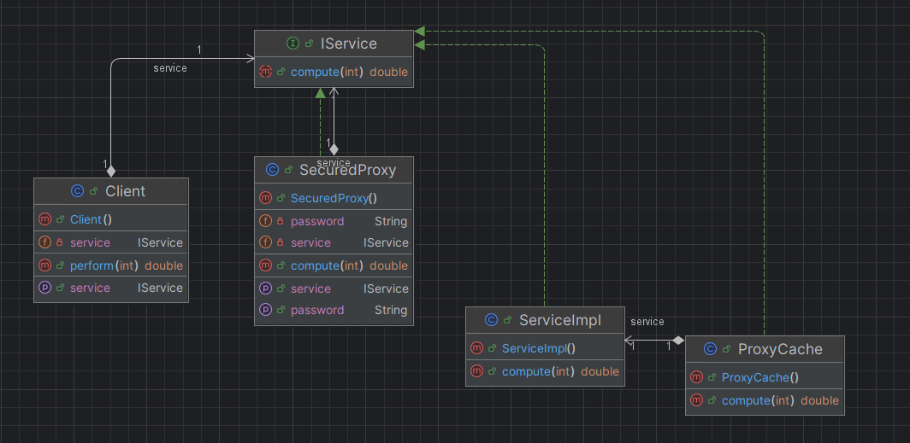

# 🛡️ Design Pattern — Proxy

## 🎯 Objectif

Le **Proxy** fournit un **intermédiaire** entre le client et l’objet réel, afin de :

- contrôler l’accès
- ajouter des comportements supplémentaires (sécurité, cache, logs…)
- protéger ou optimiser l’utilisation de l’objet réel

> 👉 Le client n’a aucune idée qu’il parle à un proxy : il utilise toujours la même interface.

---

## 📂 Catégorie

**Structure**

---

## ⚙️ Principe général

Le Proxy implémente **la même interface** que l’objet réel.  
Il intercepte les appels, peut exécuter une logique (cache, sécurité…), puis délègue au vrai service.

Client → Proxy → Service Réel


---

## 🧩 Structure de l’exemple

| Élément | Rôle |
|--------|------|
| `IService` | Interface commune |
| `ServiceImpl` | Service réel (coûteux) |
| `ProxyCache` | Proxy avec mécanisme de cache |
| `SecuredProxy` | Proxy avec contrôle d’accès |
| `Client` | Utilise le service via l’interface |
| `Test` | Démonstration |

---

## 📘 Diagramme de classes!


## 💻 Code

### 🔹 Interface du service
```java
public interface IService {
    double compute(int t);
}
```

### 🔹 Implémentation réelle
```java
public class ServiceImpl implements IService {
    @Override
    public double compute(int t) {
        System.out.println("Computing............");
        return Math.cos(t * Math.PI / 180) * Math.sqrt(t*t);
    }
}
```

### 🔹 Proxy de cache
```java
public class ProxyCache implements IService {

    private ServiceImpl service;
    private Map<Integer, Double> cache = new HashMap<>();

    @Override
    public double compute(int t) {
        if (service == null) { service = new ServiceImpl(); }

        if (!cache.containsKey(t)) {
            double result = service.compute(t);
            cache.put(t, result);
            return result;
        } else {
            return cache.get(t);
        }
    }
}
```

### 🔹 Proxy sécurisé
````java
public class SecuredProxy implements IService {

    private IService service;
    private String password;

    @Override
    public double compute(int t) {
        if (password == "1234") {
            return service.compute(t);
        } else {
            throw new RuntimeException("not authorized");
        }
    }

    public void setService(IService service) { this.service = service; }
    public void setPassword(String password) { this.password = password; }
}

````

### 🔹 Client

````java
public class Client {

    private IService service;

    public double perform(int t) {
        return service.compute(t);
    }

    public void setService(IService service) {
        this.service = service;
    }
}

````

## 🧪 Résultat d’exécution

````Text
------------Simple Test without Proxy-----------
Computing............
RES= 21.17161162940613
Computing............
RES= 21.17161162940613
Computing............
RES= 21.17161162940613

------------Cache Proxy Test-----------
Computing............
RES= 18.79385241571817
RES= 18.79385241571817
RES= 18.79385241571817

------------Cache and Secured Proxy Test (Valid Password )-----------
RES= 18.79385241571817
RES= 18.79385241571817

------------Cache and Secured Proxy Test (Wrong Password )-----------
Exception in thread "main" java.lang.RuntimeException: not authorized

````

----
👨‍💻 **RABIH Hamza** - M2- II-BDCC- ENSET Mohammédia