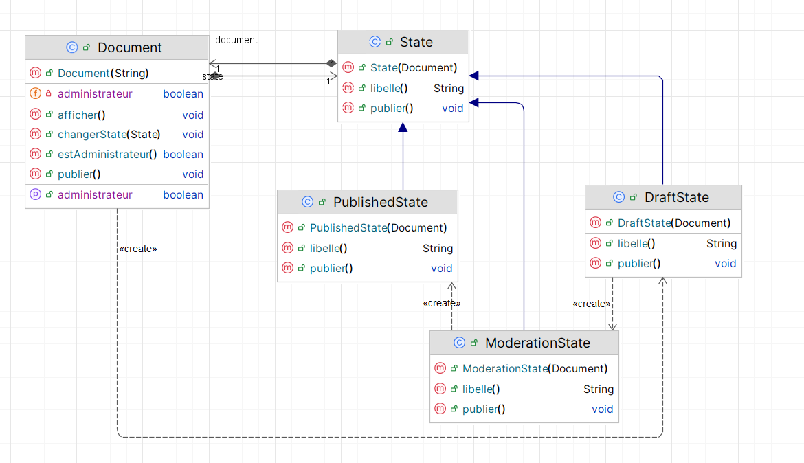

# 🧠 Design Pattern State

## 🎯 Objectif

Illustrer l’implémentation du **design pattern State (État)** en programmation orientée objet.

Le pattern State permet à un objet de **modifier son comportement quand son état interne
change**, en donnant l’impression qu’il change de classe.

L’exemple retenu est celui d’un **document** qui traverse trois états :
`BROUILLON` → `EN MODÉRATION` → `PUBLIÉ`.

---

## 📚 Définition

- **Catégorie :** Comportement
- **Objectifs :**
    - Représenter chaque état par une **classe distincte**
    - Déléguer le comportement à l’état courant
    - Rendre les **transitions** explicites
- **Raison d’utilisation :**
    - Un objet doit **se comporter différemment selon son état**, et le code se remplit
      de `if` / `switch` répétés dans toutes ses méthodes
- **Résultat :**
    - Le contexte ne contient **plus aucune condition sur l’état** : ajouter un état
      revient à ajouter une classe, sans toucher aux classes existantes

---

## 🏗️ Structure

- **State (classe abstraite)**
  Déclare l’opération dépendante de l’état, et **garde une référence vers le contexte**.

- **Concrete States (`DraftState`, `ModerationState`, `PublishedState`)**
  Implémentent le comportement propre à chaque état **et déclenchent les transitions**.

- **Document (Context)**
  Détient l’état courant et lui délègue tout. Il ne décide de rien.

---

## 🔍 State ou Strategy ? La différence en une ligne

Les deux patterns ont **exactement le même diagramme de classes**. Ce qui les sépare
n’est pas la structure, c’est **ce que la classe fille a le droit de connaître** :

| | Strategy | State |
|---|---|---|
| Référence vers le contexte | **non** | **oui** (`protected Document document`) |
| Les implémentations se connaissent | non — `StrategyImpl1` ignore `StrategyImpl2` | **oui** — `DraftState` cite `ModerationState` |
| Qui décide du changement ? | **le client** (`context.setStrategy(...)`) | **l’état lui-même** (`document.changerState(...)`) |
| Nombre de chemins possibles | tous : n’importe quelle stratégie à tout moment | **contraints** : seules les transitions prévues existent |
| Intention | interchanger des **algorithmes** équivalents | représenter un **cycle de vie** ordonné |

**Autrement dit :** une stratégie est un *outil* qu’on vous tend ; un état est une *étape*
qui sait laquelle vient après.

C’est pourquoi une Strategy ne peut pas remplacer un State : rien, dans le pattern
Strategy, n’interdit de passer de `PUBLIÉ` à `BROUILLON`. Ici, cette transition n’existe
tout simplement pas — aucune classe ne l’écrit.

---

## 📘 Diagramme d’états



---

## 🖥️ Exemple d’exécution (console + menu)

```java
Document document = new Document("Rapport de stage");

document.publier();                    // BROUILLON -> EN MODERATION
document.publier();                    // refusé : profil rédacteur
document.setAdministrateur(true);
document.publier();                    // EN MODERATION -> PUBLIE
document.publier();                    // sans effet : état final
```

**Résultat :**

```
Le brouillon est envoye a la moderation.
  [transition] BROUILLON -> EN MODERATION
Refuse : seul un administrateur peut publier ce document.
Profil courant : administrateur
Validation administrateur : le document est publie.
  [transition] EN MODERATION -> PUBLIE
Le document est deja publie : il n'y a plus rien a faire.
```

Noter que la **même** ligne `document.publier()` produit quatre comportements
différents, sans qu’aucun `if` sur l’état n’apparaisse dans `Document`.

---

## ▶️ Exécution

Lancer la classe `Main` depuis l'IDE, ou en ligne de commande :

```bash
mvn compile
java -cp target/classes ma.rabih.enset.iibdcc.eommsapp.Main
```

-------
👨‍💻 **RABIH Hamza** - M2- II-BDCC- ENSET Mohammédia
