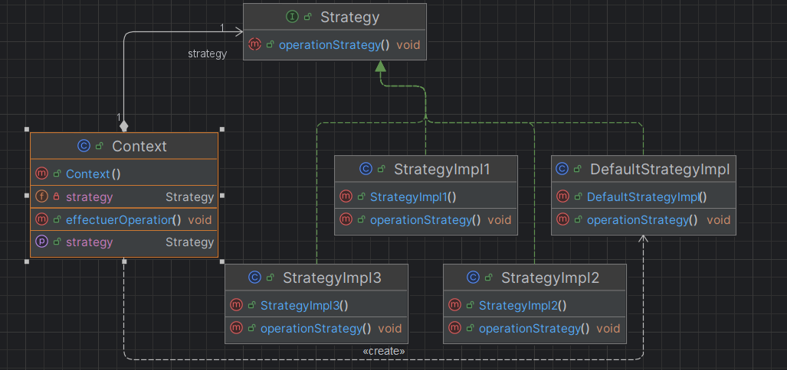
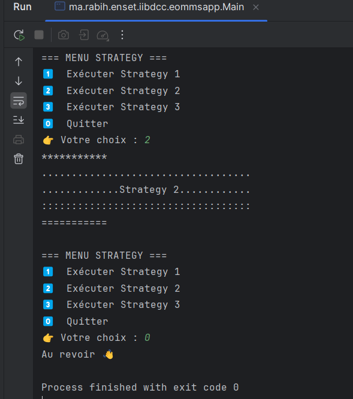

# 🧠 Design Pattern Strategy

## 🎯 Objectif

Illustrer l’implémentation du **design pattern Strategy** en programmation orientée objet.

Le pattern Strategy permet de :

- **définir une famille d’algorithmes**,
- **encapsuler chacun d’eux**,
- **les rendre interchangeables dynamiquement**,  
  tout en permettant à chaque algorithme d’évoluer indépendamment des clients qui l’utilisent.

---

## 📚 Définition

- **Catégorie :** Comportement
- **Objectifs :**
    - Définir une famille d’algorithmes
    - Encapsuler chaque algorithme
    - Les rendre interchangeables sans modifier le client
- **Raison d’utilisation :**
    - Un objet doit pouvoir **faire varier une partie de son algorithme dynamiquement**
- **Résultat :**
    - Le pattern permet **d’isoler les algorithmes** appartenant à une même famille

---

## 🏗️ Structure

- **Strategy (Interface)**  
  Déclare l’opération (l’algorithme abstrait).

- **Concrete Strategies (StrategyImpl1, StrategyImpl2, …)**  
  Implémentent différents comportements.

- **Context**  
  Délègue l’exécution de l’algorithme à la Strategy courante et permet d’en changer dynamiquement.

---

## 📘 Diagramme conceptuel



---

## 🖥️ Exemple d’exécution (console + menu)

```java
import java.util.Scanner;

public class Main {
    public static void main(String[] args) {

        Context context = new Context();
        Scanner scanner = new Scanner(System.in);
        int choix;

        do {
            System.out.println("\n=== MENU STRATEGY ===");
            System.out.println("1 - Strategy 1");
            System.out.println("2 - Strategy 2");
            System.out.println("3 - Strategy 3");
            System.out.println("0 - Quitter");
            System.out.print("Choix : ");

            choix = scanner.nextInt();

            switch (choix) {
                case 1 -> context.setStrategy(new StrategyImpl1());
                case 2 -> context.setStrategy(new StrategyImpl2());
                case 3 -> context.setStrategy(new StrategyImpl3());
                case 0 -> System.out.println("Fin du programme.");
                default -> {
                    System.out.println("Choix invalide → stratégie par défaut");
                    context.setStrategy(new DefaultStrategyImpl());
                }
            }

            if (choix != 0)
                context.effectuerOperation();

        } while (choix != 0);

        scanner.close();
    }
}
```
**Résultats :**



-------
👨‍💻 **RABIH Hamza** - M2- II-BDCC- ENSET Mohammédia
